## Hey there [](#) 

I'm a student passionate about computing stuffs and learning new things. Currently increasing my knowledge by learning more languages while working on some small projects & contributing to open source community.

## 🛠️ Languages & Tools

[](#)

## 📊 Github Stats

[](#)
<!--START_SECTION:waka-->

```txt
Total Time: 292 hrs 43 mins

Python               115 hrs 45 mins       ⣿⣿⣿⣿⣿⣿⣿⣿⣿⣷⣀⣀⣀⣀⣀⣀⣀⣀⣀⣀⣀⣀⣀⣀⣀   39.55 %
HTML                 31 hrs 28 mins        ⣿⣿⣶⣀⣀⣀⣀⣀⣀⣀⣀⣀⣀⣀⣀⣀⣀⣀⣀⣀⣀⣀⣀⣀⣀   10.75 %
Other                30 hrs 11 mins        ⣿⣿⣦⣀⣀⣀⣀⣀⣀⣀⣀⣀⣀⣀⣀⣀⣀⣀⣀⣀⣀⣀⣀⣀⣀   10.31 %
TypeScript           26 hrs 16 mins        ⣿⣿⣄⣀⣀⣀⣀⣀⣀⣀⣀⣀⣀⣀⣀⣀⣀⣀⣀⣀⣀⣀⣀⣀⣀   08.98 %
JSON                 16 hrs 9 mins         ⣿⣤⣀⣀⣀⣀⣀⣀⣀⣀⣀⣀⣀⣀⣀⣀⣀⣀⣀⣀⣀⣀⣀⣀⣀   05.52 %
```

<!--END_SECTION:waka-->

## 🔗 Connect with me
[](https://t.me/SamForSure)
[](https://github.com/ogsamrat#-connect-with-me)
[](https://github.com/ogsamrat#-connect-with-me)
[](https://github.com/ogsamrat#-connect-with-me)
