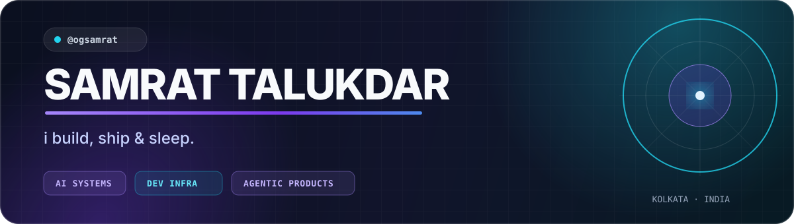

  

  
  
  

  AI systems · developer infrastructure · agentic products · onchain experiments

---

### what i do

<table>
  <tr>
    <td width="33%" valign="top">
      01 / BUILD  
      <strong>AI agents and automation</strong> 
      Agent runtimes, workflows, internal tools, and automation.
    </td>
    <td width="33%" valign="top">
      02 / IMPROVE  
      <strong>Developer infrastructure</strong> 
      Proxies, deployments, observability, and reliability.
    </td>
    <td width="33%" valign="top">
      03 / EXPLORE  
      <strong>Onchain products</strong> 
      x402 APIs, identity, wallets, and multichain systems.
    </td>
  </tr>
</table>

### selected builds

<table>
  <tr>
    <td width="50%" valign="top">
      <h3><a href="https://github.com/ogsamrat/a2a-ecommerce">a2a-ecommerce</a></h3>
      Agents that verify, negotiate, and pay onchain for autonomous commerce.
        
      <code>TypeScript</code> <code>AI agents</code> <code>payments</code>
    </td>
    <td width="50%" valign="top">
      <h3><a href="https://github.com/ogsamrat/PixaRegistry">PixaRegistry</a></h3>
      A multichain, agent-native discovery layer for verified, machine-payable APIs.
        
      <code>TypeScript</code> <code>x402</code> <code>multichain</code>
    </td>
  </tr>
  <tr>
    <td width="50%" valign="top">
      <h3><a href="https://github.com/ogsamrat/Vox">Vox</a></h3>
      An end-to-end audio intelligence pipeline for transcription and analysis with Whisper and Llama.
        
      <code>Python</code> <code>speech AI</code> <code>LLMs</code>
    </td>
    <td width="50%" valign="top">
      <h3><a href="https://github.com/ogsamrat/helix-perp">helix-perp</a></h3>
      A perpetual-futures DEX for gold, FX, and crypto with onchain orders, oracle pricing, and a shared LP vault.
        
      <code>TypeScript</code> <code>Stellar</code> <code>DeFi</code>
    </td>
  </tr>
</table>

### tools i reach for

  

  Kolkata, India

