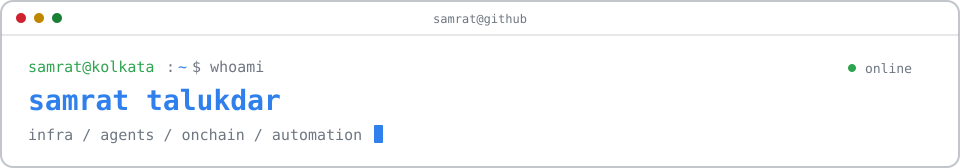

  

  
  
  

### `./focus`

  <code>agent runtimes</code>&nbsp;&nbsp;
  <code>developer infrastructure</code>&nbsp;&nbsp;
  <code>observability</code>&nbsp;&nbsp;
  <code>automation</code>&nbsp;&nbsp;
  <code>x402</code>&nbsp;&nbsp;
  <code>multichain</code>

### `./builds`

| project | what it is |
| :-- | :-- |
| [omnirush](https://github.com/omnirush-ai/omnirush-gui) | desktop coding agent for working across models |
| [a2a-ecommerce](https://github.com/ogsamrat/a2a-ecommerce) | agents verify, negotiate, and pay onchain |
| [PixaRegistry](https://github.com/ogsamrat/PixaRegistry) | registry for verified x402 APIs across chains |
| [Vox](https://github.com/ogsamrat/Vox) | transcription and audio analysis with Whisper and Llama |
| [helix-perp](https://github.com/ogsamrat/helix-perp) | perpetual futures exchange on Stellar |

### `./stack`

  

### `./activity`

  

